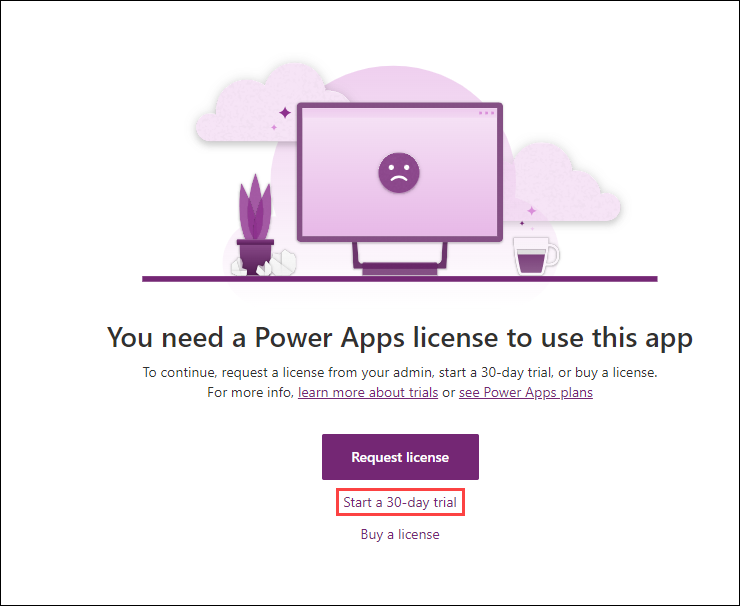
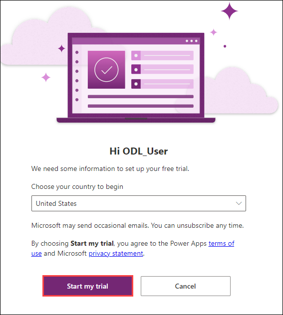

# Lab 0: Validate lab environment

### Estimated Duration: 15 minutes

## Overview

Bellows College is an educational organization with multiple buildings on campus. Campus visitors are currently recorded in paper journals. The information is not captured consistently, and there are no means to collect and analyze data about the visits across the entire campus.

Campus administration would like to modernize their visitor registration system where access to the buildings is controlled by security personnel and all visits are required to be pre-registered and recorded by their hosts.

Throughout this course, you will build applications and perform automation to enable the Bellows College administration and security personnel to manage and control access to the buildings on campus.

In this Module-lab 0, you will acquire a Power Platform trial and access the Power Platform admin center. In the admin center, you will then create a **Practice** environment that will be used for majority of the lab executions.

## Lab Objectives

You will be able to complete the following exercise:

-  **Set Up Environment :** Ensure lab environment was correctly set up for working with Power Platform tools.

## Exercise 1 : SetUp Environment

## Task 1: Acquire your Microsoft Power Platform trial tenant

1. Sign up for Power Apps using the Power Apps Trial link below
   ```
   https://apps.powerapps.com/trial
   ```

1. You'll see the **Sign in** tab. Here, enter your credentials:
 
   - **Email/Username:** <inject key="AzureAdUserEmail"></inject>
 
     
 
1. Next, provide your password:
 
   - **Password:** <inject key="AzureAdUserPassword"></inject>
 
      

1. If **Action required** pop-up window appears, click on **Ask later**.
    
1. Select **Yes** to stay signed in.

1. On the **You need a Power Apps license to use this app** page, select **Start a 30-day trial**
   
    

1. Select **Start my trial**

    

## Task 2: Create environment

1. Go to the Power Platform Admin Center using the following URL

   ```
   https://admin.powerplatform.microsoft.com
   ```

1. Log in with the previously provided credentials if prompted.

1. If you see a Welcome popup, click **Get Started**.

1. Select **Environments** from left pane and click **+ New**.

    1. For **Name**, enter **Practice<inject key="DeploymentID" enableCopy="false"/>**

    1. For **Type**, select **Trial** (Do not select the Trial
        (subscription-based) option).

    1. Change the toggle on **Add a Dataverse data store?** to **Yes**.

    1. Leave all other selections as default and click **Next**.
  
    1. Click the **+ Select** button under **Security group**.
   
    1. Select the **None** item under the **Open access** and then select **Done**..

    1. Leave the remaining options at their defaults and select **Save**.

1. Your **Practice<inject key="DeploymentID" enableCopy="false"/>** environment should now show in the list of Environments.

   > **Note**: Your environment may take a few minutes to provision. Refresh the page if needed.

## Summary

## Summary
 
In this lab you have covered the following:

-  Ensured lab environment was correctly set up for working with Power Platform tools.

### You have successfully completed the lab
