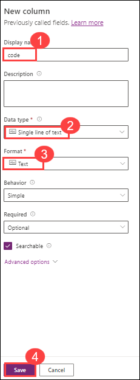

# Lab 1: Data Modeling

## Lab scenario

Bellows College is an educational organization with multiple buildings on
campus. Campus visits are currently recorded in paper journals. The information is not captured consistently, and there are no means to collect and analyze data about the visits across the entire campus.

Campus administration would like to modernize their visitor registration system where access to the buildings is controlled by security personnel and all visits are required to be pre-registered and recorded by their hosts.

Throughout this course, you will build applications and perform automation to enable the Bellows College administration and security personnel to manage and control access to the buildings on campus.

In this lab you will access your environment, create a Microsoft Dataverse database. You will also create a data model to support the following requirements:

- R1 – Track information for scheduled campus visits

- R2 – Record basic information to identify and track the visitors

- R3 – Schedule, record, and manage visits

Finally, you will import sample data into Microsoft Dataverse.

## Lab objectives

In this lab, you will perform:

+ Exercise 1: Create New Table
+ Exercise 2: Import Data

## Estimated time: 40 minutes

## Architecture Diagram

 
 
## High-level lab steps

To prepare your learning environments you will:

- Refer to the following image for the metadata description (tables and relationships).

  
- Create Visit table
- Import Visit data using an Excel spreadsheet

## Prerequisites

- Completion of **Lab 0 - Validate lab environment**

## Things to consider before you begin:

- Naming conventions - type names carefully.

## Exercise 1: Create New Table

**Objective:** In this exercise, you will create new custom table for Visits.

### Task 1: Create Visit Table and Columns

The **Visit** table will contain information about the campus visits including the visitor, scheduled times and actual times of each visit.

We would like to assign each visit a unique number that can be easily entered and interpreted by a visitor when asked during the visit check-in process.

> We use **Time zone independent** behavior to record date and time information, because time of a visit is always local to the location of the  building and should not change when viewed from a different time zone.

1. Sign into [https://make.powerapps.com](https://make.powerapps.com/) (if you are not already signed in)

1. Select your **Practice<inject key="DeploymentID" enableCopy="false"/> (1)** environment at the top right if it is not already selected.

1. Navigate to **Tables (2)** left from left pane.

1. Select **+ New table (3)** and choose **Table (advanced properties) (4)**. 

   

1. Enter `Visit`(1) for **Display Name**. Leave other fields at default.

    

1. Select **Save (2)**.

1. Under the **Schema** section, select **Columns**.

    

1. Create Scheduled Start column

	- Select **+ New column**.

	- Enter `Scheduled Start`(1) for **Display name**.

	- Select **Date and Time (2)** for **Data type**.

	- In **Required**, select **Business required (3)**.

	- Expand **Advanced options (4)**.

	- In **Time zone adjustment**, select **Time zone independent (5)**.

	- Select **Save (6)**.

         

1. Create Scheduled End column

	- Click **+ New column**.

	- Enter `Scheduled End` (1) for **Display name**.

	- Select **Date and Time (2)** for **Data type**.

	- In **Required**, select **Business required (3)**.

	- Expand **Advanced options (4)**.

	- In **Time zone adjustment**, select **Time zone independent (5)**.

	- Select **Save (6)**.

         

1. Create Actual Start column

	- Click **+ New column**.

	- Enter `Actual Start` (1) for **Display name**.

	- Select **Date and Time (2)** for **Data type**.

	- In **Required**, leave this as **Optional (3)**.

	- Expand **Advanced options (4)**.

	- In **Time zone adjustment**, select **Time zone independent (5)**.

	- Select **Save (6)**.

         

1. Create Actual End column

	- Click **+ New column**.

	- Enter `Actual End` (1) for **Display name**.

	- Select **Date and Time (2)** for **Data type**.

	- In **Required**, leave this as **Optional (3)**.

	- Expand **Advanced options (4)**.

	- In **Time zone adjustment**, select **Time zone independent (5)**.

	- Select **Save (6)**.

         

1. Create Code column

	- Click **+ New column**.

	- Enter `Code` for **Display name**.

	- Select **Text** for **Data type**.

	- Select **Save**.

         

1. Create Visitor lookup column

	- Click **+ New column**.

	- Enter `Visitor` (1) for **Display name**.

	- Select **Lookup** > **Lookup (2)** for **Data type**.

	- Select **Contact (3)** for the **Related Table**.

	- Expand **Advanced options (4)**.

	- Enter `visitor_id`(5) for **Relationship name**.

	- Select **Save (6)**.

         

## Exercise 2: Import Data

**Objective:** In this exercise you will import sample data into the Dataverse database.

### Task 1: Load Excel file to OneDrive

1. You should have the **Visits.xlsx** file stored on your virtual machine in **C:\AllFiles\PL-900-Microsoft-Power-Platform-Fundamentals-prod-new\Allfiles**.

2. Select your **Practice<inject key="DeploymentID" enableCopy="false"/>** environment at the top right if it is not already selected.

3. Click on the Waffle button in the upper left corner to change applications and select **OneDrive**. (It may take a moment for your OneDrive to be set up. Click **Your OneDrive is ready** when you see it on the screen.)

   

4. Select **+Add new** from the menu and select **Files upload**.

5. Locate and select the **Visits.xlsx** file and click **Open**.

   **Note:** This file is located in the **C:\AllFiles\PL-900-Microsoft-Power-Platform-Fundamentals-master\Allfiles** folder on your machine.
 
### Task 2: Create a dataflow

1. If not already signed in, sign in to [https://make.powerapps.com](https://make.powerapps.com/).

2. Select your **Practice<inject key="DeploymentID" enableCopy="false"/>** environment at the top right if it is not already selected.

3. Now navigate to **Tables** from left pane.

4. Locate and open the **Visit** table you created in the previous exercise.

5. Using the menu at the top, select the drop-down arrow next to **Import**, select the **Import data**.

6. In the **Choose data source** dialog, select **Excel workbook**.

7. Select **Link to File** option. Click **Browse OneDrive**. If prompted, sign in with your Microsoft 365 credentials.

8. Select the **Visits.xlsx** file which has been uploaded in OneDrive and click **Select**.

9. Select **Next**.

10. On the **Power query** > **Choose data** screen, check the **Visits** Excel workbook. 

11. Do not navigate away from this page until all the contents have been loaded.

12. Select **Next**.

13. On the **Choose destination settings** section, select **Load to existing table** under the **Load settings**.

14. On the **Destination table** drop-down menu, Select the table name starts with **crXXX_Visit** (where XXX is a random set of letters and numbers)

15. On the **Column Mapping** section, ensure all source and destination fields are correctly mapped. If any fields are not mapped, manually map them by selecting the appropriate values.

	| Destination columns  | Source columns  |
	|:---------------------|:----------------|
	| crxxx_ActualEnd      | actual end      |
	| crxxx_ActualStart    | actual start    |
	| crxxx_Code           | code            |
	| crxxx_Name           | name            |
	| crxxx_ScheduledEnd   | scheduled end   |
	| crxxx_ScheduledStart | scheduled start |

       

16. Select **Next**.

17. Select **Refresh manually** and Click on **Publish**.

    **Note:** It can take several minutes for your data to import into your table. Don’t worry if you get a few errors, that is normal, and will not impact the rest of the course.

19. Under **Visit columns and data** section, click on drop-down button **more** select the following, and click on **save**.

	| Select columns  |
	|:----------------|
	| Name (Primary)  |
	| Actual End      | 
	| Actual Start    |
	| Code            |
	| Scheduled End   |
	| Scheduled start |
	
 	
	
20. Below are the outputs you can view.

	
	

### Task 3: Verify Data Import

1. After your data has been imported, use the navigation at the left of the screen to select the **Visit** table again.

2. Verify that you see the imported data under the **Visit columns and data** section.

You have successfully created a new table and imported data.

> **Congratulations** on completing the task! Now, it's time to validate it. Here are the steps:
      
   - If you receive a success message, you can proceed to the next task.
   - If not, carefully read the error message and retry the step, following the instructions in the lab guide.
   - If you need any assistance, please contact us at labs-support@spektrasystems.com. We are available 24/7 to help you out.

<validation step="92fc1720-0f2b-42f8-9718-4e9301f3f7c4" />

### Review
In this lab, you have completed:
- Creating a New Table and importing the Data

### Proceed with the next Lab.

