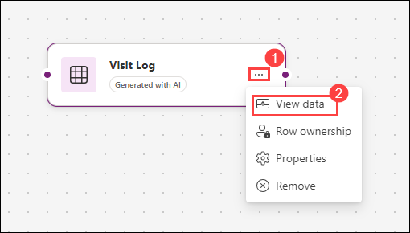
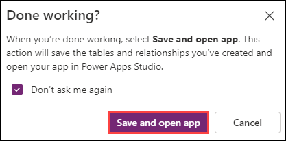

# Bonus Lab: Build a canvas app using Copilot

## Lab Scenario

Bellows College is an educational organization with multiple buildings on campus. Campus visitors are currently recorded in paper journals. The information is not captured consistently, and there are no means to collect and analyze data about the visits across the entire campus.

Campus administration would like to modernize their visitor registration system where access to the buildings is controlled by security personnel and all visits are required to be pre-registered and recorded by their hosts.

In this lab, you will use Copilot to create a new canvas application for logging visits. 

## Lab objectives

In this lab, you will perform:

+ Exercise 1: Use Copilot to build a college visits application.

## High-level lab steps

We will follow the below outline to design the canvas app:

- Describe the app you want to build

- Use Copilot to modify the supporting table structure

## Exercise 1: Use Copilot to build a college visits application.

**Objective:** In this exercise, you will create a canvas app by connecting to an Campus visits table.

### Task 1: Create the initial application

1. Navigate to https://make.powerapps.com

1. Select the **Practice<inject key="DeploymentID" enableCopy="false"/>** environment at the top right, if it is not already selected.

1. In the **Use everyday words to describe what your app should collect, track, list, or manage..** box, enter the following text. `Create an application that logs visits to a college campus`. 

    

1. Select the **Go** button.

1. Copilot will begin to build a table structure to support your application. 

   >**Note**: When using generative AI, you will not always get the same exact results. It is possible that your table will not exactly match the table created for another environment. 

1. On right hand side, select table structure in Copilot window and then select **Table options**.

1. Select **One table** option and then select **Apply**.
 
    

1. To see the table structure, select the table and click on **View data** button 

    

1. In the **What would you like to do next?** box, enter the text: Add two columns, Time in and Time out in the table. Both should be date and time fields. 

1. Select the **Go** button or press **Enter**. 

    

1. Scroll to the side of the table and verify that the **Time in** and **Time out** columns are created. 

    

1. Since we are logging the visitors in and out time, we no longer need any other visit date fields. 

1. Locate the **Visit Date** field (or equivalent field) and in the **What would you like to do next?** box, enter the text: Remove the Visit Date Field (or equivalent field). 

   >**Note**: If required, update the field name to be removed from relevant table name.

1. Select the **Go** button. 

    

1. Remove any additional date fields that might be present other than **Time in** and **Time out**. 

1. Initially, a field such as a **Purpose** field was formatted with a text data type was added. We are going to have Copilot change it to a drop-down (Choice) menu. 

1. In the **What would you like to do next?** enter the following text: Change the Purpose field to a choice menu with the following choices: Campus Tour, Career Fair, Meet with Professor, Student Counseling, Other. 

1. Select the **Go** button. 

    

1. Since we also want to capture the building number, in the **What would you like to do next?**, enter: Add a building column. 

1. Select the **Go** button. 

    

1. Once you are happy with your table, select the **Save and open app** button. 

    

1. If necessary, On the **Done working?** screen, select **Don’t ask me again**, and select the **Save and open app** button. 

    

    

**Congratulations!!** you have used Copilot to create a new app. 

## Proceed to next lab
